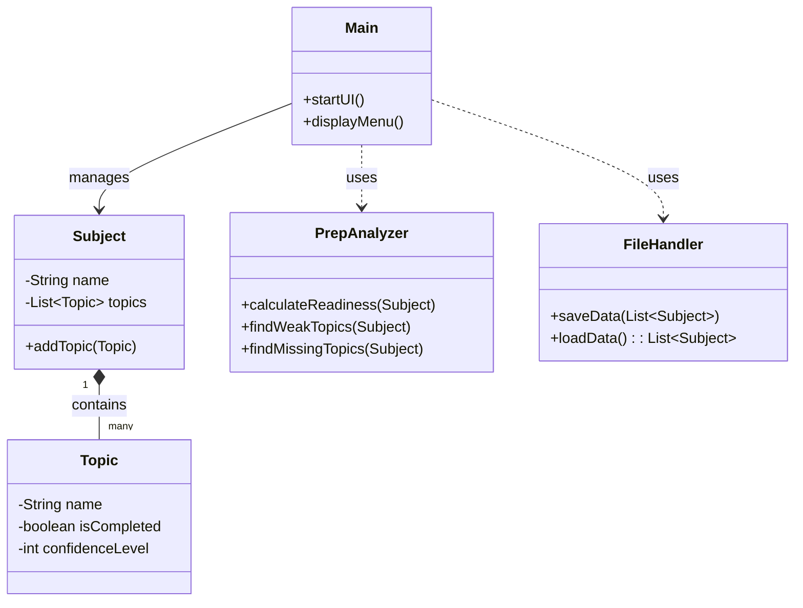

<div align="center">
  
  
  <h1>🎓 PrepGap – Exam Preparation Gap Finder</h1>
  
  <p><strong>A robust Java-based precision tool to identify and bridge your academic learning gaps.</strong></p>

  [](https://www.java.com/)
  [](https://github.com/harshsahu)
  [](LICENSE)
  [](https://en.wikipedia.org/wiki/Command-line_interface)
</div>

---

## 📌 The Problem
Students often find themselves overwhelmed by vast syllabi and lack a quantitative way to measure their preparation. The "I think I know this" feeling is often misleading, leading to:
- **Missed Topics**: Incomplete syllabus coverage.
- **Overconfidence**: Neglecting weak areas despite having "read" them.
- **Lack of Focus**: Ineffective revision during high-pressure exam windows.

## 🚀 The PrepGap Solution
**PrepGap** addresses this by providing a data-driven approach to tracking. By combining **Syllabus Coverage** with **Confidence Scoring**, it generates a precise "Gap Report" that tells you exactly where you stand.

### ✨ Key Features
- **📊 Readiness Analytics**: Calculate overall preparation percentage for every subject.
- **🔍 Gap Detection**: 
    - **Missing Topics**: Automatically identify any pending units.
    - **Weak Topics**: Flags completed topics where your confidence score is low (<= 2).
- **📝 Flexible Management**: Effortlessly CRUD (Create, Read, Update, Delete) subjects and topics.
- **💾 Automated Persistence**: All progress is automatically saved to a local database (`subjects.txt`).
- **🛡️ Robust I/O**: Intelligent error handling ensures no data loss during entry.

---

## 🛠️ Tech Stack & Concepts
- **Language**: Java 8 or Higher
- **Persistence**: Flat-file Delimited Storage (`.txt`)
- **Core Concepts**:
  - **OOP Principles**: Model-based design (Subject, Topic).
  - **Custom Serialization**: Efficient pipe-delimited data handling.
  - **Java Collections**: High-performance `ArrayList` structures.

---

## 📂 Project Architecture



---

## ⚙️ Quick Start

### Prerequisites
- JDK 8 or above installed on your machine.
- A terminal or command-line interface.

### Installation & Run
1. **Clone the project** (or download files).
2. **Compile the source**:
   ```bash
   javac src/*.java -d .
   ```
3. **Launch the application**:
   ```bash
   java src.Main
   ```

---

## 💡 Example Workflow
1. **Add Subject**: `DSA`
2. **Add Topic**: `Binary Search Trees` (Status: `Completed`, Confidence: `2`)
3. **Run Analysis**:
   - PrepGap will mark "Binary Search Trees" as a **Weak Topic** because of the low confidence score.
   - It will prompt you: *"You've finished this, but you're not confident. Schedule a revision session!"*

---

## 🔮 Roadmap
- [ ] **GUI Upgrade**: Transition to JavaFX/Swing UI.
- [ ] **Data Export**: Export preparation reports as PDF/HTML.
- [ ] **Pomodoro Timer**: Integrated focus sessions for tracking topics.
- [ ] **Cloud Sync**: Securely backup data to a remote cloud.

---

## 👨‍💻 Developer Information
**Harsh Sahu**  
*Academic Project - 2026*  
**Registration No**: 24BAI10561  
**VIT BHOPAL UNIVERSITY**

---
<div align="center">
  <sub>Built with ❤️ for student productivity.</sub>
</div>
